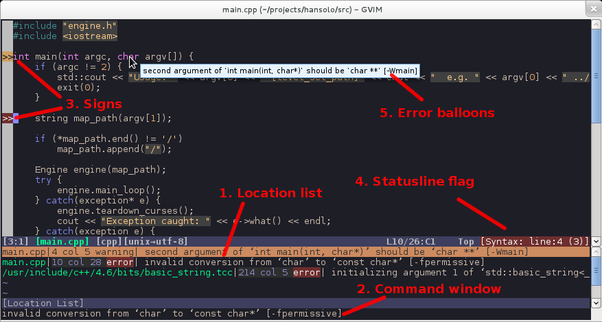

# <center>VIM 配置文档<center/>
******************************************************
## 安装 Vundle 插件
* `git clone https://github.com/QCZL/MyVimrc.git ~/.vim`
* `ln -s ~/.vim/.vimrc ~/.vimrc`
* 执行上面两句命令即可获取 vundle 插件和 .vimrc 配置文件，然后打开 VIM，在命令行模式下执行 BundleInstall 命令即可
* 效果图如下：<br><br>
  
## 插件介绍
* ### DoxygenToolkit.vim
  * 插件地址 [DoxygenToolkit](https://github.com/vim-scripts/DoxygenToolkit.vim) <br>
  * 插件主要功能是为函数、结构体等生成说明文字
  * 生成函数、结构体说明 <br><br>
* ## kien/ctrlp.vim
  * 插件地址 [kien/ctrlp.vim](https://github.com/kien/ctrlp.vim)
  * 插件主要功能是进行文件搜索，在 VIM 普通模式下使用 ctrl + p 即可进行文件搜索
* ## scrooloose/nerdcommenter
  * 插件地址 [scrooloose/nerdcommenter](https://github.com/scrooloose/nerdcommenter) 
  * 插件主要功能是进行函数注释，使用方式如下：
  ```
  "1、 \cc 注释当前行和选中行
  "2、 \cn 没有发现和\cc有区别
  "3、 \c<空格> 如果被选区域有部分被注释，则对被选区域执行取消注释操作，其它情况执行反转注释操作
  "4、 \cm 对被选区域用一对注释符进行注释，前面的注释对每一行都会添加注释
  "5、 \ci 执行反转注释操作，选中区域注释部分取消注释，非注释部分添加注释
  "6、 \cs 添加性感的注释，代码开头介绍部分通常使用该注释
  "7、 \cy 添加注释，并复制被添加注释的部分
  "8、 \c$ 注释当前光标到改行结尾的内容
  "9、 \cA 跳转到该行结尾添加注释，并进入编辑模式
  "10、\ca 转换注释的方式，比如： /**/和//
  "11、\cl \cb 左对齐和左右对其，左右对其主要针对/**/
  "12、\cu 取消注释>
  ```
* ## flazz/vim-colorschemes
  * 插件地址 [flazz/vim-colorschemes](https://github.com/flazz/vim-colorschemes)
  * VIM 主题插件，该插件内置许多主题可供使用者选择，.vimrc.bundle 中配置如下
  ```
  set term=screen-256color
  set background=dark
  set t_Co=256
  colorscheme molokai "设置主题，可在 .vim/bundle/vim-colorschemes/colors/ 中查看已有主题"
  ```
* ## chxuan/change-colorscheme
  * 插件地址 [chxuan/change-colorscheme](https://github.com/chxuan/change-colorscheme)
  * 插件功能是快速切换 VIM 主题。该插件在低版本VIM上可能无法运行
  * 切换快捷键
  > - F9  查看当前主题
  > - F10 随机切换主题
  > - F11 上一个主题
  > - F12 下一个主题
* ## w0rp/ale
  * 插件地址 [w0rp/ale](https://github.com/w0rp/ale)
  * 插件功能是提供语法检查。异步工作方式，速度快，不卡顿。只支持 VIM8.0 及以上版本
  * 使用快捷键 
  > - <Leader\>s 触发/关闭语法检查
  > - 普通模式下，sp前往上一个错误或警告，sn前往下一个错误或警告
  > - <Leader\>d 查看错误或警告的详细信息
  * 效果图 <br> <br>
* ## vim-syntastic/syntastic
  * 插件地址 [vim-syntastic/syntastic](https://github.com/vim-syntastic/syntastic)
  * 插件功能是提供语法检查，相比 ale 速度稍慢。但是支持 VIM8.0 一下版本
  * 可是使用 F4 快速 触发/关闭 此功能 <br>  <br>
* ## majutsushi/tagbar
  * 插件地址 [tagbar](https://github.com/majutsushi/tagbar)
  * 插件功能是在代码文件右侧生成 变量区，可快速定位。
  * 本配置默认不展示变量区。可以使用快捷键 F8 触发/关闭。<br> <br>
* ## jiangmiao/auto-pairs
  * 插件地址 [auto-pairs](https://github.com/jiangmiao/auto-pairs)
  * 插件功能是自动匹配并生成 [] "" '' {} 等符号。
* ## scrooloose/nerdtree
  * 插件地址 [nerdtree](https://github.com/scrooloose/nerdtree)
  * 插件功能是在代码左侧生成文件树，方便进行文件跳转。
  * 本配置默认不显示文件树。在普通模式下可以使用 ctrl + n 触发/关闭 文件树。<br><br>
* ## haya14busa/incsearch.vim
  * 插件地址 [incsearch.vim](https://github.com/haya14busa/incsearch.vim)
  * 此插件可以取代 VIM 默认的文本搜索功能 / ，?
  * 效果图 <br>  <br>
* ## maciakl/vim-neatstatus
  * 插件地址 [vim-neatstatus](https://github.com/maciakl/vim-neatstatus)
  * VIM 状态栏美化插件
* ## garbas/vim-snipmate
  * 插件地址 [vim-snipmate](https://github.com/garbas/vim-snipmate)
  * 插件功能是协助用户自动生成代码片段，提高码代码的速度。
  * 例如 C 语言中，输入 for 后按 Tab 键，即可自动生成如下代码，连续按下 Tab 键可以在 for 中的参数中跳转
  ```
  for (i = 0; i < count; i++) {
      /* code */
  }
  ```